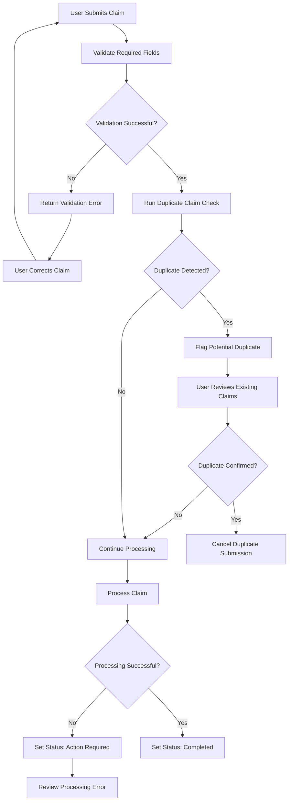

# Claims Processing Workflow

## Overview

This document illustrates the high-level claims processing workflow for the fictional Healthcare Claims Processing Platform (HCPP).

The workflow shows how HCPP validates submitted claims, identifies errors or duplicate claims, and routes valid claims for processing.

## Claims Processing Workflow

## Workflow Description

### 1. Claim Submission

The user submits a claim containing the required member, provider, diagnosis, procedure, and service information.

### 2. Validation

HCPP validates required fields and claim data before processing.

If validation fails:

1. HCPP returns a validation error.
2. The user reviews the identified issue.
3. The user corrects the claim.
4. The claim is resubmitted.

### 3. Duplicate Claim Check

After successful validation, HCPP checks for potentially duplicate claims.

If a potential duplicate is identified, the user reviews existing claims before determining whether processing should continue.

### 4. Claim Processing

Claims that pass validation and duplicate checks enter the processing workflow.

Processing may result in:

- **Completed** — Processing finished successfully.
- **Action Required** — An error or condition requires additional review.

## Related Documentation

- [Quick Start Guide](./quick-start-guide.md)
- [Troubleshooting Guide](./troubleshooting-guide.md)
- [Configuration Reference](./configuration-reference.md)
